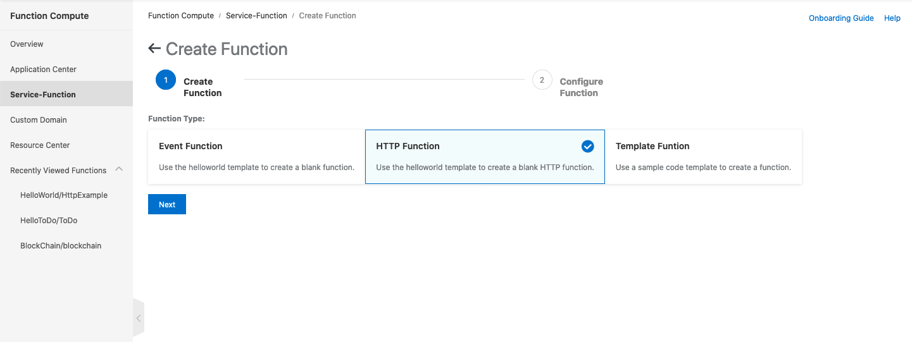

# A simple demonstration creates an API on Alibaba Cloud Function Compute
This GIT demonstrate how to implement a ToDo List API in NodeJS and deploy to Alibaba Cloud Function Compute.

### Step 1 Create a new function at Function Compute
This API is implemented with NodeJS. Function Compute can help to config an HTTP Function (Function Compute > Service-Function > Create Function) by selecting the "HTTP Function" (as follow)

### Step 2 Config the function
Follow the instructions to config  the function by entering the service name, function name, function handler, memory, timeout and instance concurreny and the trigger.

You need to select "nodejs10" as the Runtime.

### Step 3 (Suggested) Download the existing source to Visual Studio Code
If you wish to implement the Visual Studio Code, you can sync the source code to your local computer. (Make sure you have already added Aliyun Serverless extension and installed Docker)

## Summary of each source code files

### index.js
index.js is currently set as the entry point of the API.  In the source code, you can find the raw-body framework at the beginning of the source code.

    const getRawBody = requires('raw-body');

This framework can help to parse the request body if the API request includes body in JSON format.  Sample call as follow:

    getRawBody(req, (err, body) => {
        // do something to pass the body to router
    });

### route.js
A set of middleware.  It allows us to keep the logic in separate files.  The following routes are going to implement in the application:

- GET /count - Return the number of items in the list
- GET /list - Return the list
- POST /add - Add an item to the list
- POST /clear - Reset the list
- PUT /remove - Remove last item from the list

It is necessary to return status code for any request call in order to make the API response with no unexpected message.

### todo.js
Managing the list.  Noted that the current sample did not validate the JSON from the request body.  In additions, there is no validation to the existing list items (such as duplication).

